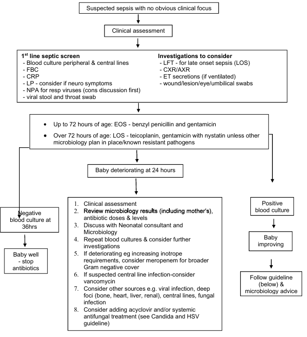

:::: {style="text-align: left;"}

Scope and exceptions 
This guideline applies to: 
 
Setting: Directorate - Neonatology 
Individuals: All Neonatal Staff and Midwifery Staff 
Speciality: Neonatology 
 
This guideline does not apply to adults and children outside those on the 
postnatal wards and neonatal unit. 
 
The guideline uses the terms 'woman' or 'mother' throughout. These should be 
taken to include people who do not identify as women but are pregnant or 
have given birth. Similarly, where the term 'parents' is used, this should be 
taken to include anyone who has main responsibility for caring for a baby 
https://www.nice.org.uk/guidance/ng194

1 Scope and exceptions 1 
2 Summary and guideline 3 
2.1 Aim of guideline 3 
2.2 Summary flowchart of neonatal infection management 4 
3 Early onset sepsis (EOS) 5 
3.1 Antenatal risk factors for early onset sepsis1 5 
3.1.1 Red flag 5 
3.1.2 Risk factors 5 
3.2 Clinical signs of early onset sepsis1 5 
3.2.1 Red flag clinical indicators 5 
3.2.2 Transitional symptoms (relevant to early onset sepsis only)3 5 
3.2.3 Other clinical signs1 5 
3.3 Medical review for early onset sepsis1,3 6 
3.4 Action required for early onset sepsis 6 
3.5 Observations required1 7 
3.6 Investigation for early onset sepsis 7 
3.6.1 Babies undergoing observation only 7 
3.6.2 Babies on antibiotic treatment for early onset sepsis 7 
3.6.2.1 Haematology 7 
3.6.2.2 Clinical chemistry 7 
3.6.2.3 Microbiology 7 
3.6.2.4 Other investigations 8

3.7 Empiric antimicrobial treatment for early onset sepsis 8 
3.8 Stopping antibiotics in well infants with previously suspected EOS 9 
3.8.1 Reassuring investigations 9 
3.8.2 Indeterminate investigations 9 
4 Late onset sepsis (LOS) 10 
4.1 Signs and symptoms of late onset sepsis in infants1 10 
4.2 Investigation for late onset sepsis 10 
4.2.1 Haematology 10 
4.2.2 Clinical chemistry 10 
4.2.3 Microbiology 11 
4.2.4 Other specimens 11 
4.3 Empiric antimicrobial treatment for late onset sepsis 11 
4.4 Prophylactic antifungals for late onset sepsis 12 
5 Blood culture interpretation for EOS and LOS 12 
6 CSF investigations/interpretation for EOS and LOS 13 
6.1 Interpreting neonatal CSF parameters 13 
7 Antimicrobial treatment course length (EOS and LOS) 14 
7.1 Targeted antimicrobial treatment depending on clinical syndrome or 
pathogen 14 
7.2 Blood culture negative infection 14 
7.3 Meningitis 14 
7.3.1 Repeat lumbar punctures 14 
7.3.2 Negative CSF culture/PCR/but equivocal microscopy result/high clinical 
suspicion 15 
7.4 Infants with invasive S. aureus disease 15 
7.5 Ophthalmia neonatorum1 15 
7.5.1 Mildly inflamed/erythematous eyes 15 
7.5.2 Severely affected eyes 15 
7.5.3 Infective causes: 16 
8 References - literature 21 
9 References - clinical decision making 21 
10 Rationale for differing from NICE guidance1 22 
11 Appendices 22 
12 Document Control and Version history 27 
13 Consultation and review 27 
14 Document imprint 27

2 Summary and guideline 
2.1 Aim of guideline 
1
.  
The aim of this guideline is to summarise the local application of the NICE guidelines 
(last updated 2024)
The risk factors and empirical antibiotics of choice differ between early and late onset 
infection: 
Early onset infection (EOS) is defined as any infection in an infant less than 72 
hours of age 
Late onset infection (LOS) is defined as any infection in an infant after 72 hours 
of age. 
Babies will be assessed using this guideline if there are antenatal risk factors 
increasing their risk of sepsis (section 3.1) in the first 72 hours of age or if they have 
any clinical concern regarding suspected sepsis at any point (section 3.2). 
Note in this guideline, the terms sepsis and infection are used interchangeably, as 
these are the terms used in practice however there is a clinical difference between 
infants with an infection (microbiologically proven or otherwise) and true sepsis with 
systemic multi-organ effects.

Summary flowchart of neonatal infection management 

{width="80%" fig-align="center"}
::::
